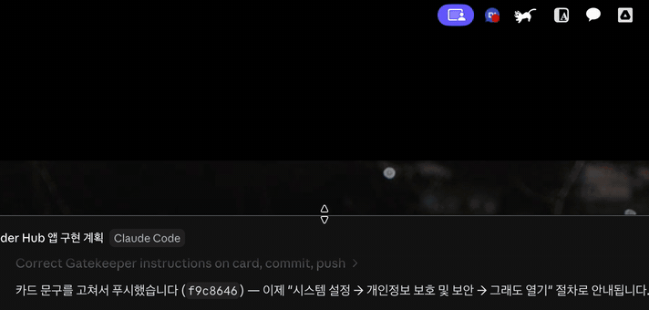

# TopDock

**Turn your MacBook's notch into a quick launcher.**
Shove the cursor into the notch — or press <kbd>⌥Space</kbd> — and a floating panel of
your folders and apps appears. Launch, browse, drop files in, and it gets out of your
way the moment you leave.



## Features

- **Notch trigger** — push the cursor all the way into the notch to open the panel.
  A deliberate gesture, so it never pops up while you use the menu bar.
- **Works without a notch** — on external displays, the top-center edge acts as the
  trigger zone (width adjustable in Settings).
- **Global hotkey** — <kbd>⌥Space</kbd> toggles the panel anywhere, no accessibility
  permission required.
- **In-panel browsing** — click a folder to browse inside the panel: breadcrumb
  navigation, sorting, hidden-file toggle, search, and Quick Look preview.
- **Drag & drop, both ways** — drag files out to Finder or other apps; drop a file
  onto a folder tile to copy it there. You can even start a drag, shove into the
  notch mid-drag, and drop — all in one motion.
- **Workspaces** — separate sets of folders/apps for different contexts, switchable
  from the panel header.
- **Stays out of your way** — non-activating panel (never steals focus), auto-hides
  like the Dock, pin to keep it open. English & Korean UI.
- **Native and tiny** — pure Swift/SwiftUI + AppKit, zero dependencies, ~1 MB app.

## Install

1. Download the latest `TopDock-x.y.z.zip` from [Releases](../../releases) and unzip
   into `/Applications`.
2. First launch is blocked by Gatekeeper (the app is not notarized):
   open **System Settings → Privacy & Security**, scroll down, and click **Open Anyway**.
3. macOS will ask for access to folders (Desktop, Downloads, …) the first time you
   browse them — this is the standard per-folder privacy prompt.

Requires an Apple Silicon Mac running macOS 14 or later.

### Build from source

```bash
git clone https://github.com/shr0eq/TopDock.git
cd TopDock
xcodebuild -project NotchHub.xcodeproj -scheme NotchHub -configuration Release build
```

The internal target/bundle id keeps the project's original codename (`NotchHub`);
the product it builds is `TopDock.app`.

## Usage

| Action | How |
|---|---|
| Open panel | Push cursor fully into the notch (or top-center of an external display) · <kbd>⌥Space</kbd> · menu bar icon |
| Open item | Click (folders browse in-panel; <kbd>⌘</kbd>-click reveals in Finder) |
| Context menu | Right-click → Open · Reveal in Finder · Quick Look |
| File something away | Drag it onto a folder tile (copies, originals untouched) |
| Add items | Drop onto the empty grid area, or Settings → Items |
| Keep panel open | Pin button in the header |
| Switch workspace | Workspace menu in the header |

## How it works

Notch geometry comes from public `NSScreen` APIs (`safeAreaInsets`,
`auxiliaryTopLeftArea/RightArea`); the trigger is a 2 pt strip at the very top edge,
watched by a global+local `mouseMoved` monitor with a dwell timer. The panel is a
borderless, non-activating `NSPanel` hosting SwiftUI, kept below the system drag
layer so drops route to it. Design notes and the pitfalls we hit along the way
(in Korean) live in [docs/](docs/).

## License

[MIT](LICENSE) — © 2026 Won-Young Choi.
Built with the help of [Claude Code](https://claude.com/claude-code).
